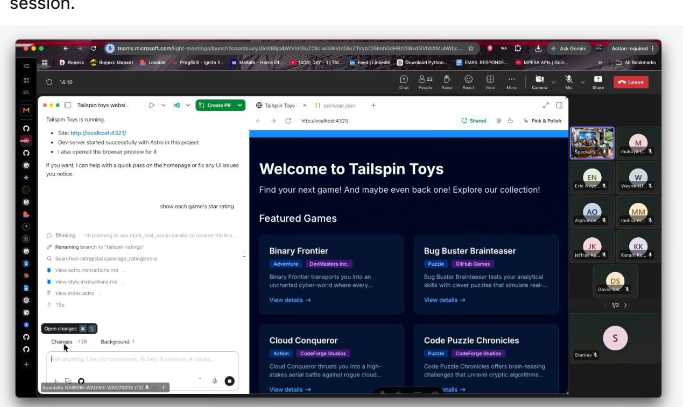
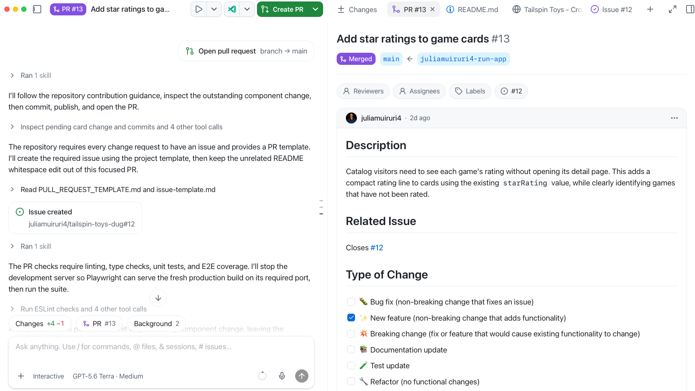
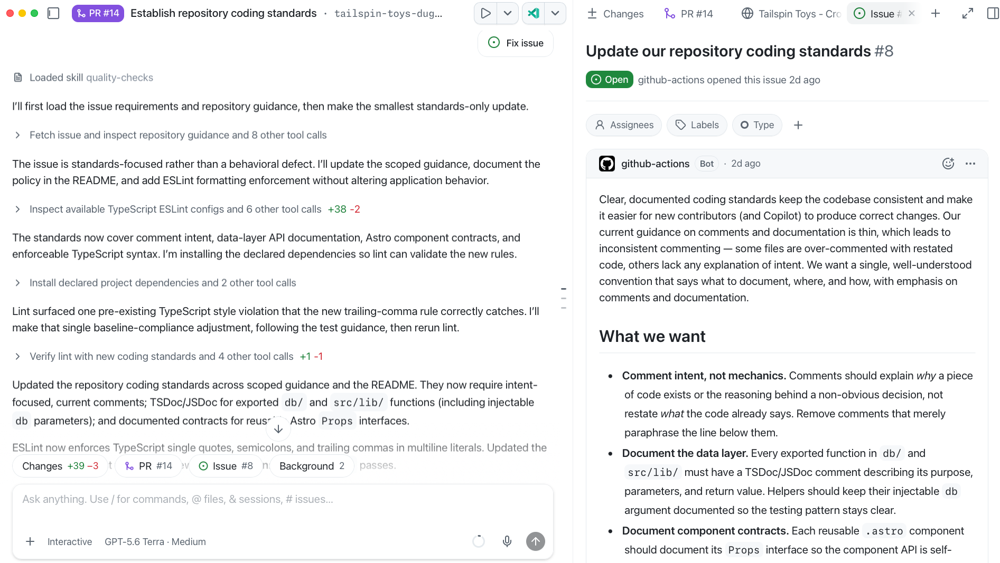
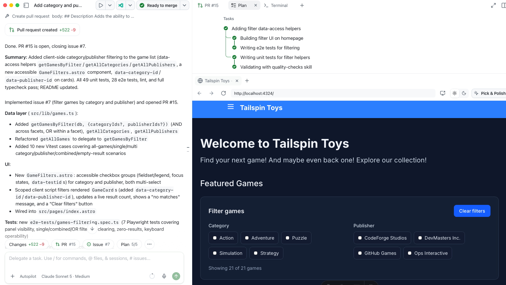
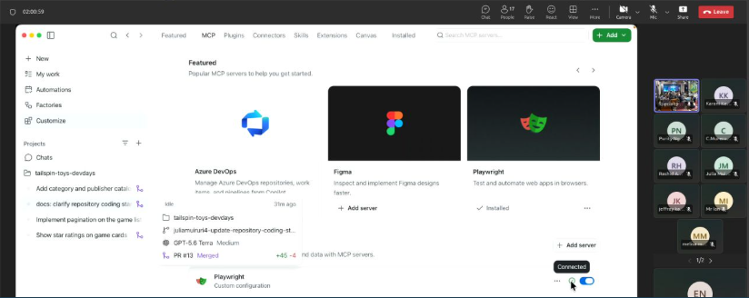
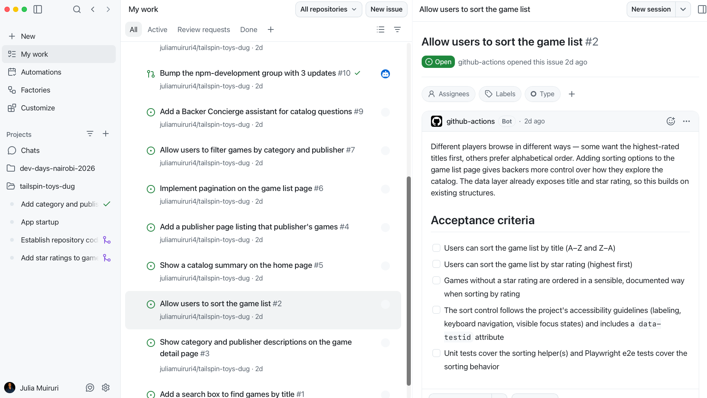
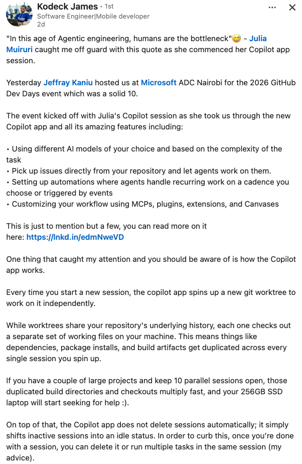
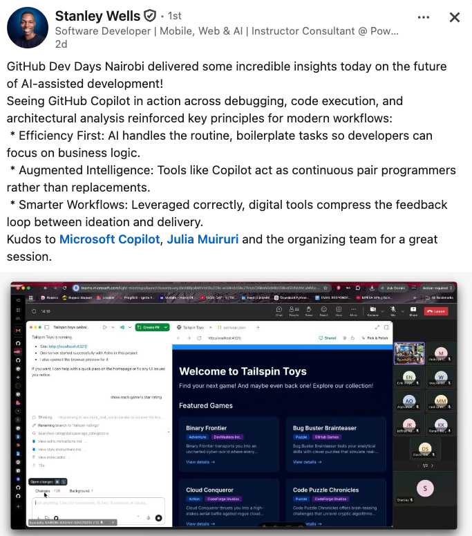
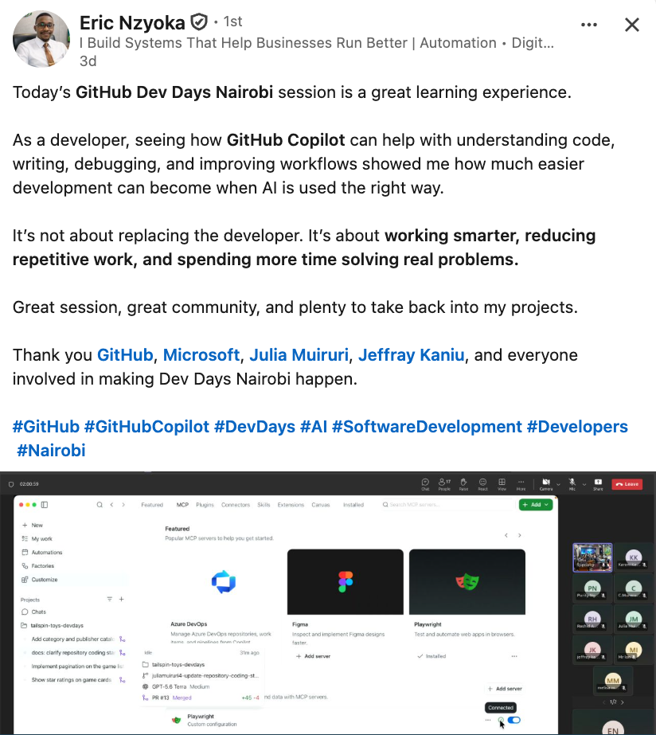

# GitHub Dev Days Nairobi 2026

  

- **Event:** [GitHub Dev Days | Nairobi, Kenya](https://luma.com/d95fa0it)
- **Date:** September 25, 2026
- **Venue:** Microsoft ADC, Nairobi

## What is the GitHub Copilot app?

The [GitHub Copilot app](https://gh.io/app) is a desktop app, built on Copilot CLI, that turns agent-driven development into one focused workspace with native GitHub issue/PR management. Instead of babysitting a single chat, you run **parallel agent sessions** — each spinning up its own isolated git worktree (when you need to) and picking up issues straight from your repository.

> "In this age of agentic engineering, humans are the bottleneck."

The point isn't that developers are replaced — it's that the app removes the busywork (routine edits, context-switching, chasing CI) so developers spend their time on judgment calls: what to build, what to review, what to ship.

## What we did

Hands-on workflows and exercises in the [Copilot app workshop](https://github-samples.github.io/copilot-workshops/app/):

<table>
<tr>
<th width="20%">Step</th>
<th width="42%">What we did</th>
<th width="38%">In the app</th>
</tr>
<tr>
<td valign="top"><strong>🌟 Small change first</strong></td>
<td valign="top">Added star ratings to the game cards, including a clear state for unrated games. We then used the repository's <code>make-contribution</code> skill to follow its issue and pull-request rules, run the required quality checks, create the linked issue, and open a focused PR.  <strong>Features:</strong> agent skills, tool calls, native issues and pull requests.</td>
<td align="center"></td>
</tr>
<tr>
<td valign="top"><strong>📐 Standards from an issue</strong></td>
<td valign="top">Started directly from a backlog issue and asked the agent to establish repository coding standards. It updated scoped guidance, documented comment and API conventions, added ESLint enforcement, and validated the changes before opening the PR.  <strong>Features:</strong> issue-to-agent-session workflow, issue context in the app, quality-checks skill.</td>
<td align="center"></td>
</tr>
<tr>
<td valign="top"><strong>🧵 Isolated agent session</strong></td>
<td valign="top">Built accessible category and publisher filtering in a separate session and git worktree, while the other workshop tasks remained independent. The agent planned the work, implemented the data and UI layers, wrote unit and E2E tests, and showed the running result alongside its completed task list.  <strong>Features:</strong> parallel sessions, isolated worktrees, Plan/Autopilot mode, task plan, integrated browser.</td>
<td align="center"></td>
</tr>
<tr>
<td valign="top"><strong>🎭 Real-browser verification</strong></td>
<td valign="top">Connected the Playwright MCP server and used browser automation to inspect the real application, exercise the filter controls, and support E2E validation instead of treating the code diff as proof that the experience worked.  <strong>Features:</strong> MCP servers, Playwright browser tools, integrated browser preview, E2E testing, customizable tool catalog.</td>
<td align="center"></td>
</tr>
<tr>
<td valign="top"><strong>🔀 From issue to merge</strong></td>
<td valign="top">Followed work from the repository backlog into separate sessions and pull requests, then used Agent Merge to monitor review feedback, CI failures, and branch drift while leaving the final merge under human control.  <strong>Features:</strong> My work, repository backlog, session status, native issue/PR management, Agent Merge.</td>
<td align="center"></td>
</tr>
</table>

## Community Voices

<table>
<tr>
<td width="33%" align="center" valign="top"></td>
<td width="33%" align="center" valign="top"></td>
<td width="33%" align="center" valign="top"></td>
</tr>
</table>

## Resources

1. [GitHub Copilot app](https://gh.io/app)
2. [Copilot app workshop ](https://github-samples.github.io/copilot-workshops/app/)
3. [GitHub Copilot app for Beginners](https://gh.io/copilot-app-course)
4. [GitHub Copilot app for Beginners Playlist](https://youtube.com/playlist?list=PLNBWjViYXaIY&si=skqoOQ1y7gNuUOhn)